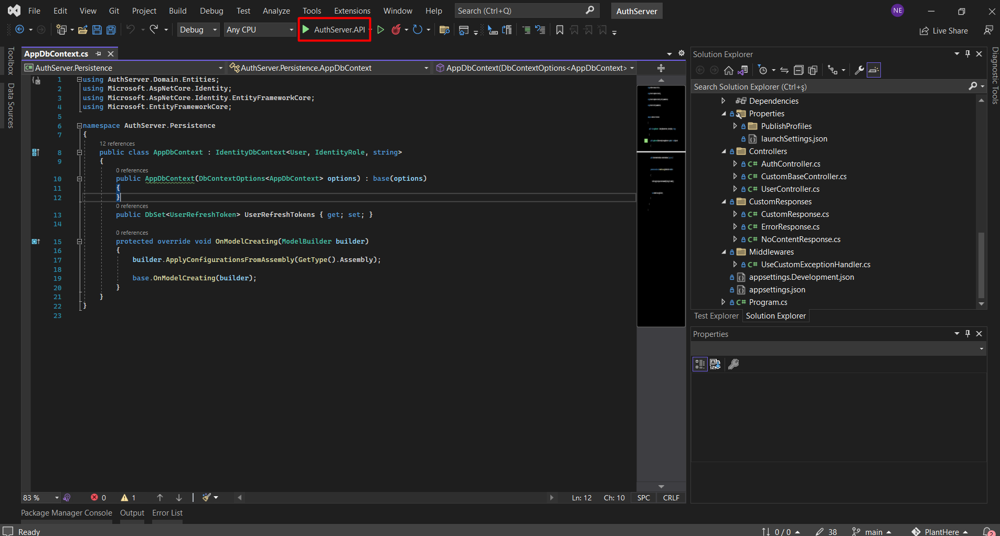
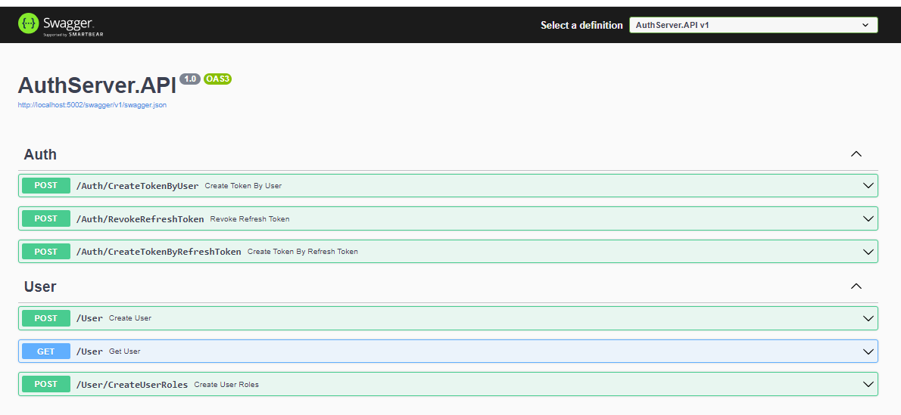
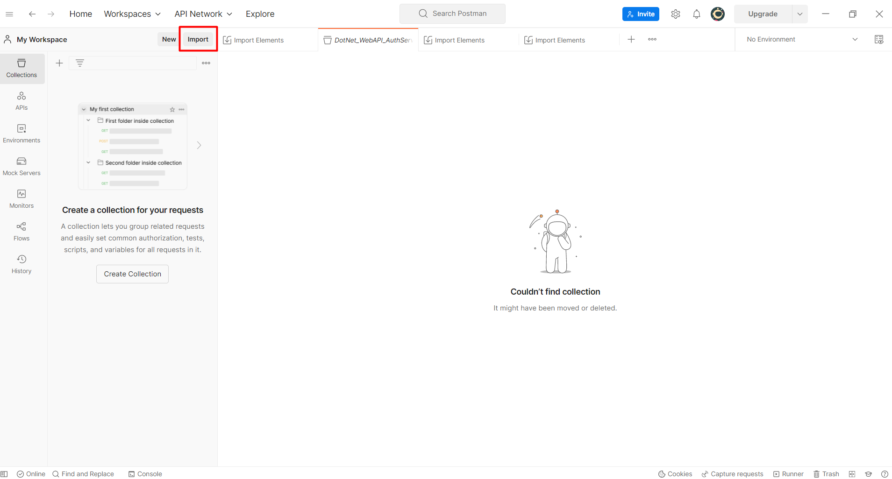
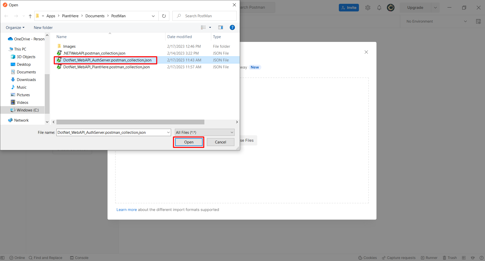
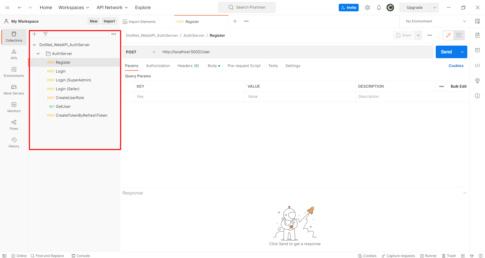

<h1 align="center">
   
    
   
  AuthServer .Net
</h1>

## Table of contents

- [Overview](#overview)
  - [Technology Used](#technology-used)
  - [Topics Cover](#topics-cover)
- [Getting Started](#getting-started)
  - [RabbitMQ Running Docker](#rabbitmq-running-docker)
  - [AuthSever Run](#authsever-run)
- [API Documentation](#api-documentation)
  - [Swagger](#swagger)
  - [Import Postman Collection](#import-postman-collection)

# Overview

   
  
   
   
  <h3>
    This API is responsible for authentication and authorization processes such as token, refresh token distribution, register.
  </h3>
   

## Technology Used

- .Net 6 
- Entity Framework Core
- MSSQL
- MediatR
- RabbitMq
- Swagger
- Aspnetcore Identity

## Topics Cover

- Onion Architecture
- CQRS
- Clean Architecture
- Repository Design Pattern
- Options Design Pattern
  
# Getting Started
  ## RabbitMQ Running Docker

  - Download docker from https://www.docker.com/products/docker-desktop
  - RabbitMQ creating container "**docker run -d --name rabbitmqcontainer -p 1453:15672 -p 5672:5672  rabbitmq:3-management**"

  ## AuthSever Run
  - Download Visual Studio https://visualstudio.microsoft.com/de/downloads/
  - Open AuthSever/AuthSever.sln
  - Run
  

# API Documentation

  ## Swagger

  - Swagger Document Link http://localhost:5002/swagger/index.html
  
  

  ## Import Postman Collection

  - Download Postman from https://www.postman.com/downloads/

  - Export collection path "**../Documents/Postman/DotNet_WebAPI_AuthServer.postman_collection.json**"
  
  
  

  - You can now send a request to the AuthServer API.

  

  