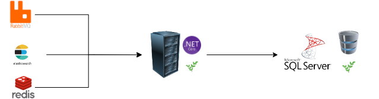
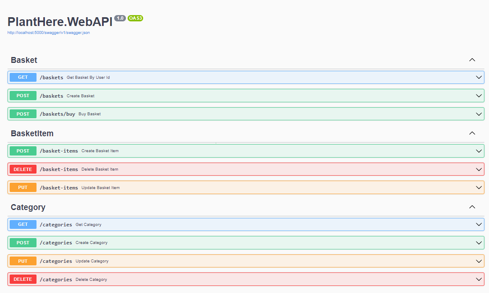
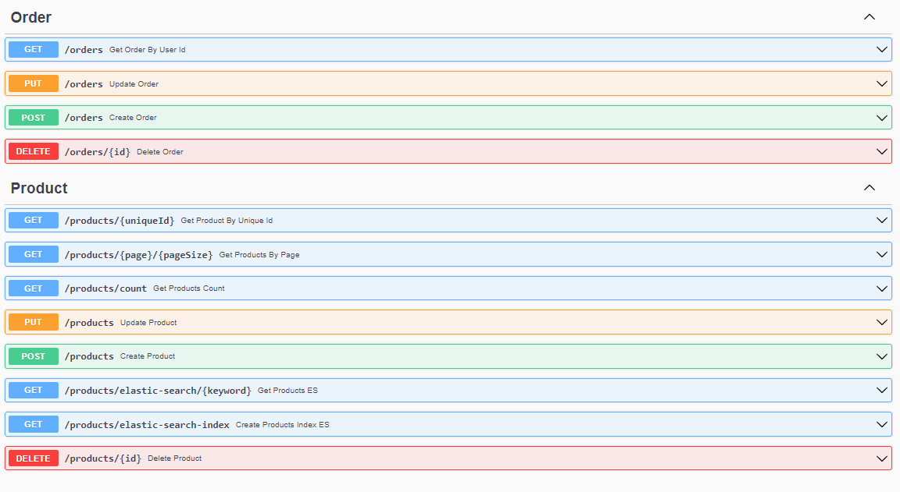
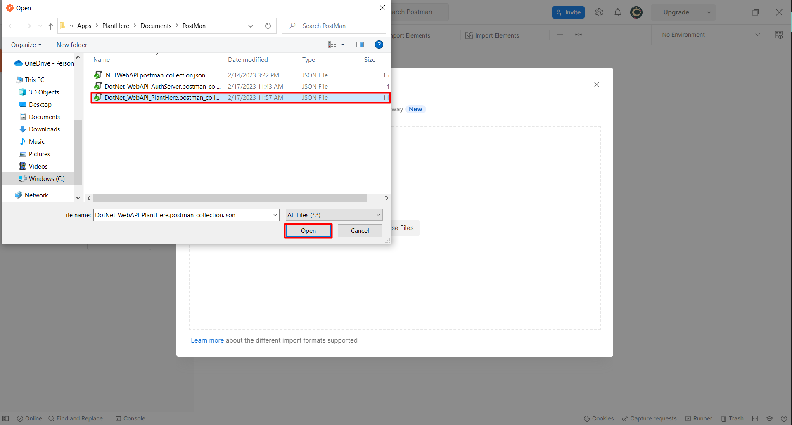
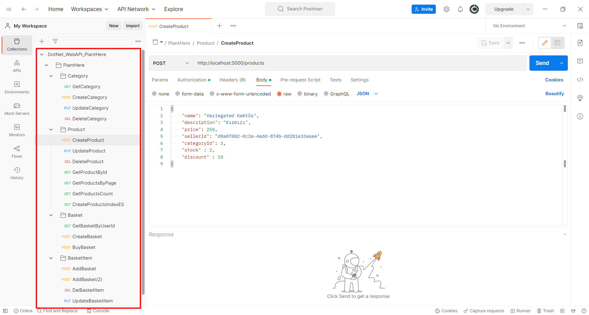

<h1 align="center">
   
    
   
  Plant Here .Net
</h1>

## Table of contents

- [Overview](#overview)
  - [Technology Used](#technology-used)
  - [Topics Cover](#topics-cover)
- [Getting Started](#getting-started)
  - [Elastic Seach, Redis ,RabbitMQ Running Docker](#elastic-seach-redis-rabbitmq-running-docker)
  - [PlantHere Run](#planthere-run)
- [API Documentation](#api-documentation)
  - [Swagger](#swagger)
  - [Import Postman Collection](#import-postman-collection)

# Overview

   
  
   
   
  <h3>
    This API is a e-commerce API. It provides order creation, adding/deleting products to a cart, purchasing and product listing processes.
  </h3>
   

## Technology Used

- .Net 6 
- Entity Framework Core
- MSSQL
- MediatR
- RabbitMq
- Swagger
- Redis Cache
- Elastic Search

## Topics Cover

- Onion Architecture
- Domain Driven Design 
- CQRS
- Clean Architecture
- Decorator Design Pattern
- Repository Design Pattern
- Options Design Pattern
  
# Getting Started
  ## Elastic Seach, Redis ,RabbitMQ Running Docker

  - Download docker from https://www.docker.com/products/docker-desktop
  - Elastic Seach creating container "**docker run -d --name elasticsearch -p 9200:9200 -p 9300:9300 -e "discovery.type=single-node" elasticsearch:7.11.1**"
  - Redis creating container "**docker run -d --name redis-stack-server -p 6379:6379 redis/redis-stack-server:latest**" 
  - RabbitMQ creating container "**docker run -d --name rabbitmqcontainer -p 1453:15672 -p 5672:5672  rabbitmq:3-management**"

  ## PlantHere Run

  - Download Visual Studio https://visualstudio.microsoft.com/downloads/
  - Open PlantHere/PlantHere.sln
  - Run
  

# API Documentation

  ## Swagger

  - Swagger Document from http://localhost:5000/swagger/index.html
  
  
  

  ## Import Postman Collection

  - Download postman from https://www.postman.com/downloads/

  - Export collection path "**../Documents/Postman/DotNet_WebAPI_PlantHere.postman_collection.json**"
  
  
  

  - You can now send a request to the PlantHere API.

  

  - Note : See Authserver/README.md for authentication and authorization.

  