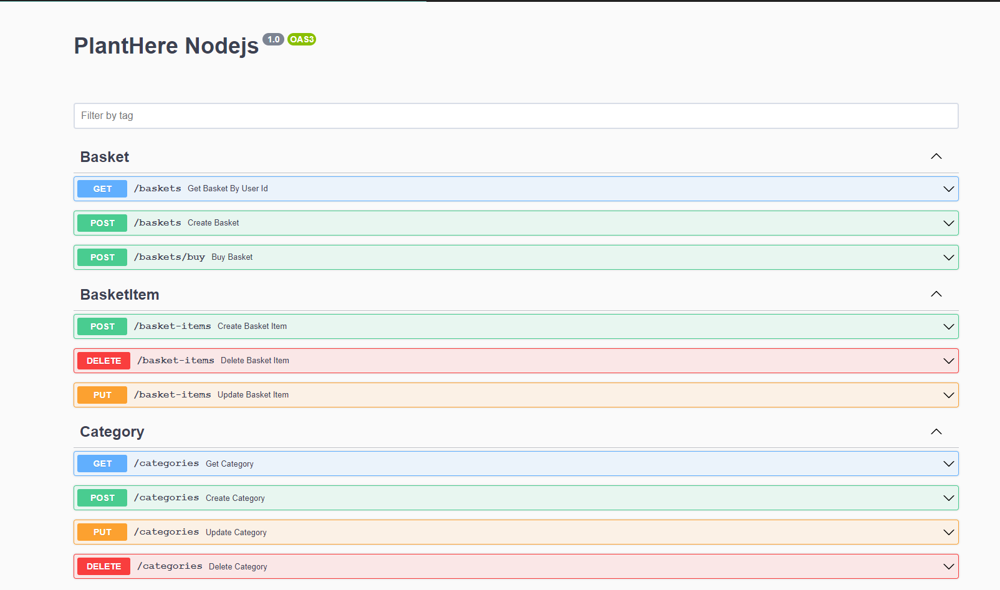
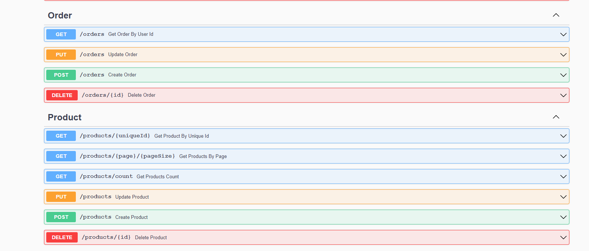
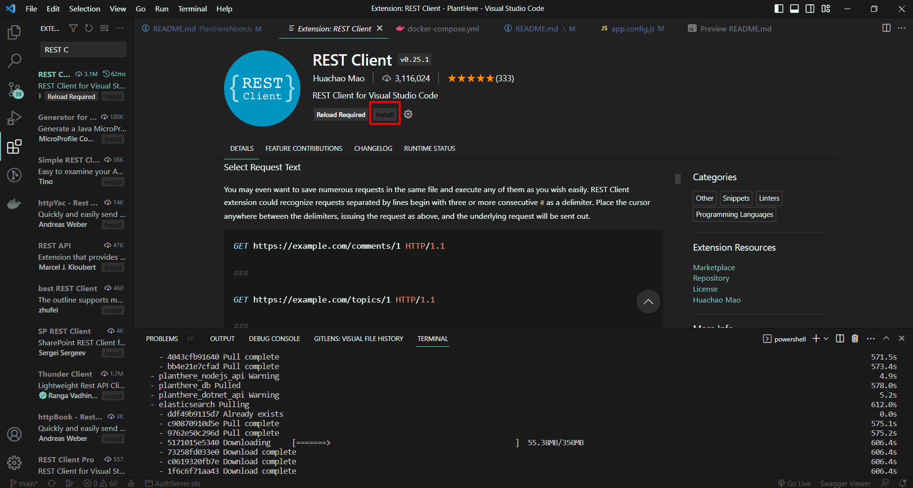

<h1 align="center">
   
    
  <br>
  Plant Here Nodejs
</h1>

## Table of contents

- [Overview](#overview)
  - [Technology Used](#technology-used)
- [Getting Started](#getting-started)
  - [PlantHere Nodejs Run](#planthere-nodejs-run)
- [API Documentation](#api-documentation)
  - [Swagger](#swagger)
  - [REST Client](#rest-client)


# Overview

<div align="center">
  <br>
  
  <br>
  <br>
  <h3>
    This API is a e-commerce API. It provides order creation, adding/deleting products to a cart, purchasing and product listing processes.
  </h3>
  <br>
</div>

## Technology Used

- Nodejs 
- MSSQL
- Swagger
- Express
- Sequelize
- Swagger

# Getting Started
  ## PlantHere Nodejs Run
  
  - Download Nodejs https://nodejs.org/en/download/

  ```bash
    cd .\Core\PlantHere.Aplication
    npm i
    cd ..
    cd ..

    cd .\Core\PlantHere.Domain
    npm i
    cd ..
    cd ..

    cd .\Infrastructure\PlantHere.Infrastructure
    npm i
    cd..
    cd..
    
    cd .\Infrastructure\PlantHere.Persistance
    npm i
    cd ..
    cd ..

    cd .\Presentation\PlantHere.WebAPI
    npm i
    npm start
  
  ```


# API Documentation

  ## Swagger

  - Swagger Document link http://localhost:4000/swagger/
  
  
  

  ## REST Client

  - Install REST Client 
  

  - Collection path "**./RestFullRequests**"
  
  - You can now send a request to the PlantHere Nodejs API.
  
  

  - Note : See Authserver/README.md for authentication and authorization.


  