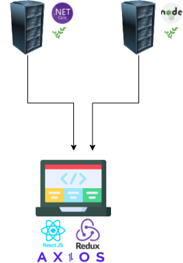

<h1 align="center">
   
    
  <br>
  Plant Here ReactJs
</h1>

## Table of contents

- [Overview](#overview)
  - [Technology Used](#technology-used)
- [Getting Started](#getting-started)
  - [PlantHere ReactJs Run](#planthere-reactjs-run)


# Overview

<div align="center">
  <br>
  
  <br>
  <br>
  <h3>
    This interface is a e-commerce interface that use 2 different API's. 
    It performs operations (purchasing, product viewing, etc.) by sending a request to the selected API (node js or .net) from the API's with the same endpoints.
  </h3>
  <br>
</div>

## Technology Used

- React 
- Material UI
- React-Redux
- Redux 
- Axios

# Getting Started
  ## PlantHere ReactJs Run
  
  - Download Nodejs https://nodejs.org/en/download/

  ```bash
    cd .\plant-here-reactjs\
    npm i
    npm start
  ```